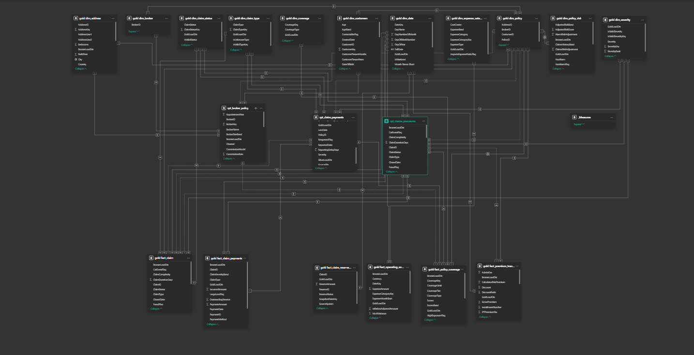

# Data Model – Palthanio Home Insurance Analytics

This section documents the **Power BI semantic data model** used in the **Palthanio Home Insurance Analytics project**. The semantic model is built on top of the **Gold layer of the SQL Data Warehouse** and is designed to support insurance portfolio analysis, underwriting performance monitoring, and claims analytics.

The model follows a **star schema design**, ensuring optimal performance, scalability, and usability for reporting.

---

# Purpose of the Semantic Model

The semantic layer serves as the **analytics-ready layer** for Power BI. It translates the curated data from the Gold layer into a structure that is optimized for:

- Business reporting
- Interactive dashboards
- KPI analysis
- Self-service analytics

Key goals of the model include:

- Ensuring **consistent business definitions**
- Supporting **fast analytical queries**
- Providing a **clear relationship structure**
- Enabling **reusable DAX measures**

---

# Data Model Overview

The model is structured around **fact tables and dimension tables**, following standard **Kimball dimensional modelling practices**.

The diagram below illustrates the relationships between tables in the model.

---

# Model Structure

## Fact Tables

Fact tables contain **quantitative measures and transactional data** used for analysis.

### Fact Premium Transactions
Stores premium information for insurance policies.

Key metrics derived from this table include:

- Total Net Premium
- Total Earned Premium
- Premium by Broker
- Premium by Property Type

---

### Fact Claims Payments
Contains details about claim payments made by the insurer.

Key metrics derived include:

- Total Claims Paid
- Average Claim Cost
- Claims Frequency
- Largest Claim Cost

---

### Fact Operating Expenses
Stores operational and administrative expenses associated with running the insurance business.

Key metrics derived include:

- Total Operating Expenses
- Expense Ratio
- Combined Ratio

---

# Dimension Tables

Dimension tables provide **context for the fact data**, allowing users to slice and filter the data.

### Dim Policy
Contains policy-level information such as:

- Policy ID
- Policy start and end dates
- Property characteristics
- Risk bands

Used to analyse:

- Portfolio size
- Risk distribution
- Policy segmentation

---

### Dim Address
Contains geographic information about insured properties.

Used for analysis by:

- City
- Region
- Location risk exposure

---

### Dim Broker
Stores information about brokers responsible for selling policies.

Used for:

- Broker performance analysis
- Distribution channel reporting

---

### Dim Claim Type
Categorises different types of claims.

Examples include:

- Fire
- Escape of Water
- Storm
- Theft
- Accidental Damage

Used to identify **high-cost claim categories**.

---

### Dim Claim Status
Tracks the lifecycle of claims.

Examples include:

- Open
- Closed
- In Progress

Used to analyse **claims workflow and operational performance**.

---

### Dim Coverage
Defines policy coverage types.

Used to analyse **insurance coverage distribution**.

---

### Dim Date
The date dimension supports **time intelligence calculations**.

Used for:

- Monthly trend analysis
- Year-over-year comparisons
- Seasonal claim analysis

---

# Model Design Principles

The semantic model follows several **best practices for Power BI data modelling**.

### Star Schema Design
Fact tables connect directly to dimension tables to improve:

- Query performance
- Model simplicity
- DAX calculation efficiency

---

### Single Direction Relationships
Relationships are configured to minimise ambiguity and prevent circular filtering.

---

### Surrogate Keys
Dimension tables use surrogate keys from the data warehouse to maintain **referential integrity**.

---

### Measure Table
All business logic is centralised within a **dedicated measures table** to improve:

- Model organisation
- Maintainability
- Discoverability for report developers

---

# Key Business KPIs Supported

The model enables calculation of several important **insurance KPIs**, including:

- Total Net Premium
- Total Claims Paid
- Loss Ratio
- Expense Ratio
- Combined Ratio
- Claims Frequency
- Average Claim Cost
- High Risk Property Share
- Severe Claim Share

These KPIs allow stakeholders to evaluate **portfolio profitability and underwriting performance**.

---

# Model Optimisation

The model is optimised for performance through:

- Proper star schema relationships
- Reduced cardinality in dimension tables
- Dedicated measure tables
- Efficient DAX calculations
- Column selection and model pruning

Further details can be found in:

`Model_Optimisation.md`

---

# Related Documentation

Additional documentation for the semantic model can be found in this folder:

- `Measures_Documentation.md` – explanation of all DAX measures
- `Model_Optimisation.md` – performance optimisation techniques
- `Palthanio_Insurance_Data_Model.png` – visual representation of the model

---

# Summary

The Palthanio semantic model provides a **robust analytical layer for insurance analytics**, enabling:

- Portfolio monitoring
- Claims analysis
- Broker performance evaluation
- Underwriting risk assessment

By combining **dimensional modelling best practices with Power BI semantic modelling**, the solution supports scalable and maintainable business intelligence reporting.
